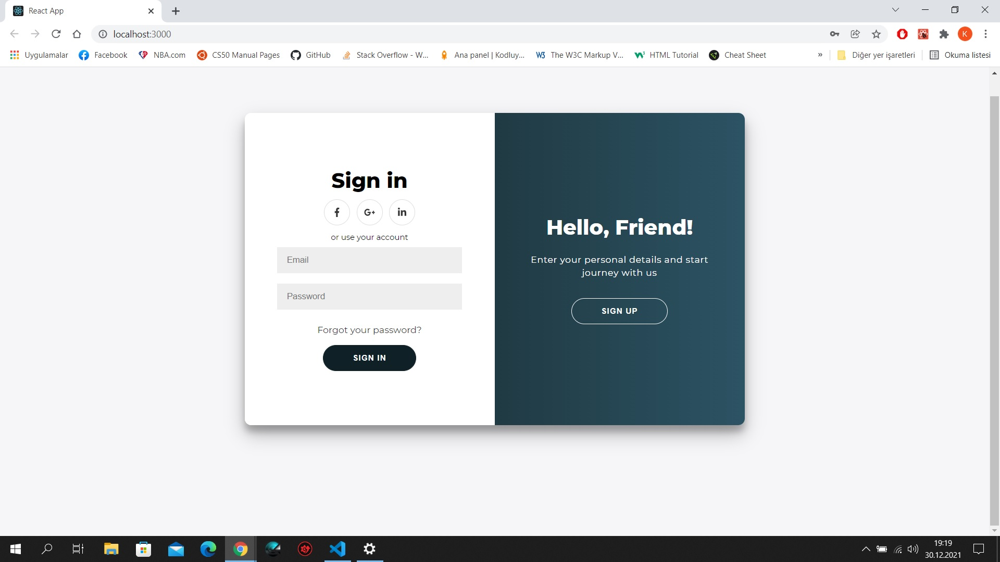
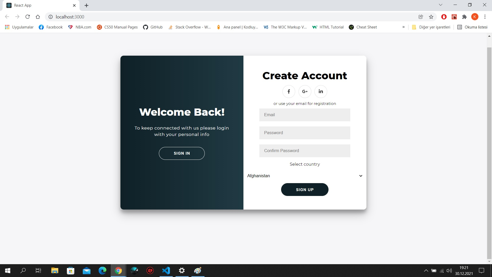

# Login/Sigup Form

## Sayfamız bir container yapısı içerisinde, 2si solda üst üste ve 2si sağda üst üste olmak üzere 4panelden oluşmakta.

## Signup butonuna tıklanmasıyla, sağdaki panel sola giderken, soldaki sign in paneli de sağa geçiyor ve aynı işlemi yapan sign up paneli görünür hale geliyor.

## Aynı işlem Signin butonuna tıklandığınında ters mantıkla işliyor.

## Kaydolmak için gerekli bilgileri doğru bir şekilde girip Sign up butonuna bastığımızda girilen veriler konsola loglanıyor.

 
 

#### Inspired by https://dribbble.com/shots/5311359-Diprella-Login

#### Speacial thanks to [Florin POP](https://www.florin-pop.com/blog/2019/03/double-slider-sign-in-up-form/) for amazing description.